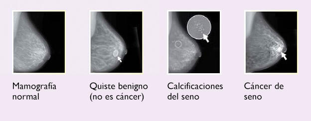
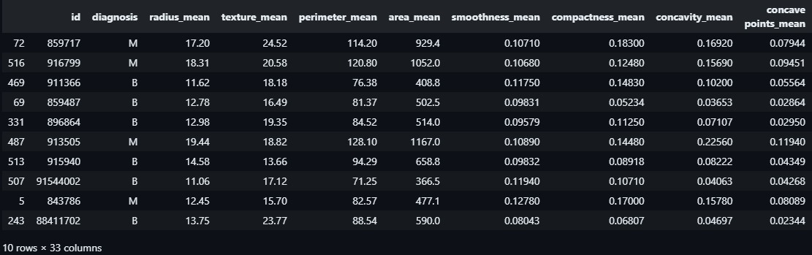
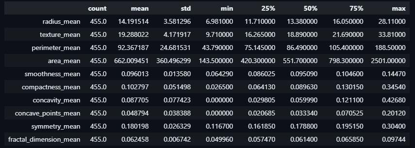
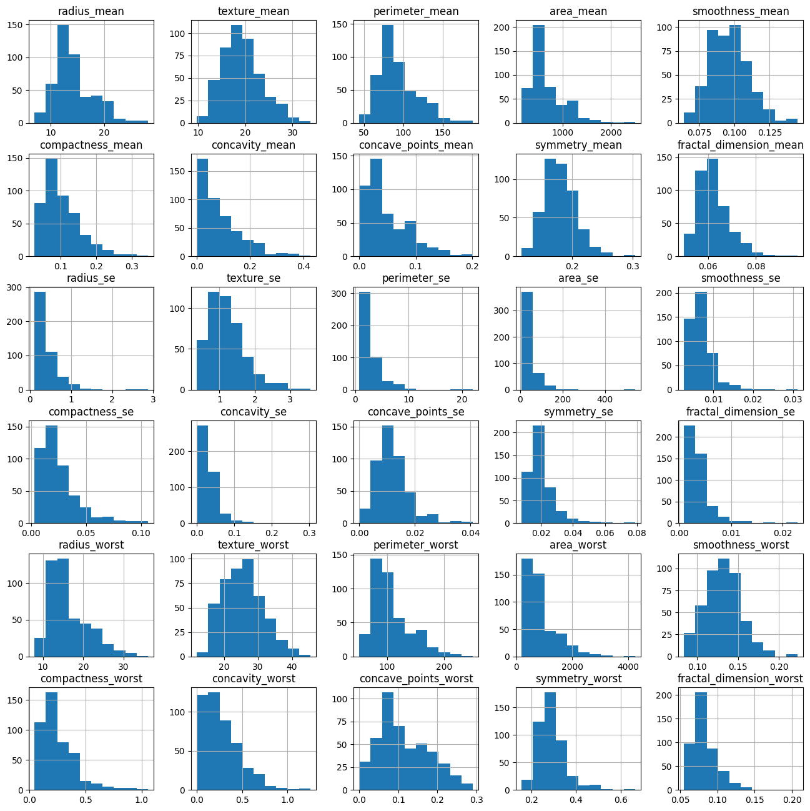
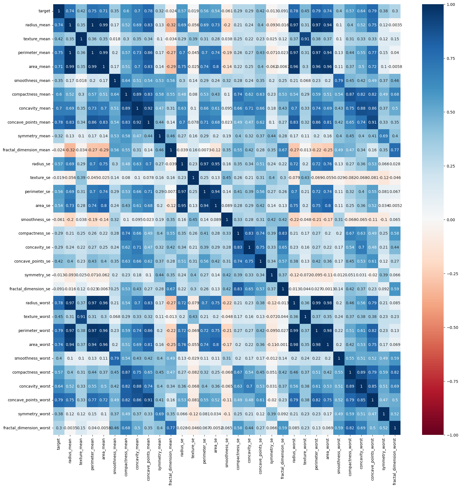
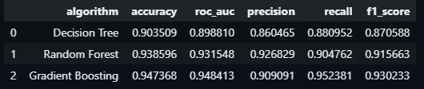
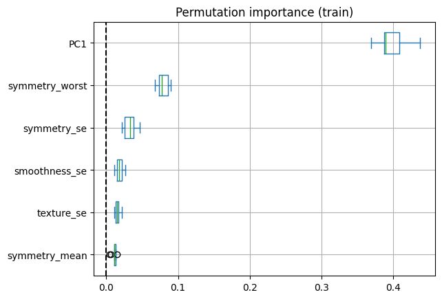

# Análisis Comparativo de Algoritmos de Machine Learning en la Predicción del Cáncer de Mama

## Introduccion 
<<<<<<< HEAD

El cáncer de mama es una enfermedad que se origina en las células del tejido mamario, cuando estas comienzan a crecer de manera anormal y descontrolada. Es uno de los principales problemas de salud pública a nivel mundial, siendo la forma de cáncer más común entre las mujeres.

Según la Organización Mundial de la Salud (OMS), el cáncer de mama representa aproximadamente el 25% de todos los casos de cáncer diagnosticados en mujeres. Esto lo convierte en un desafío global que afecta a millones de personas, no solo por su prevalencia, sino también por su impacto físico, emocional y social.

En este contexto, el machine learning (aprendizaje automático) ha emergido como una herramienta poderosa para abordar este problema. Esta disciplina de la inteligencia artificial permite a los sistemas analizar grandes volúmenes de datos médicos y aprender patrones que pueden ser útiles para detectar, diagnosticar y predecir la evolución del cáncer de mama. Al combinar el análisis avanzado de datos con la práctica médica, el machine learning tiene el potencial de transformar significativamente los enfoques actuales de prevención y tratamiento, mejorando la precisión diagnóstica y facilitando la toma de decisiones clínicas.

**1.2 Importancia del análisis de datos**

El análisis de datos desempeña un papel fundamental en la lucha contra el cáncer de mama, permitiendo:

=======
El cáncer de mama es una enfermedad que se origina en las células del tejido mamario, cuando estas comienzan a crecer de manera anormal y descontrolada. Es uno de los principales problemas de salud pública a nivel mundial, siendo la forma de cáncer más común entre las mujeres.

Según la Organización Mundial de la Salud (OMS), el cáncer de mama representa aproximadamente el 25% de todos los casos de cáncer diagnosticados en mujeres. Esto lo convierte en un desafío global que afecta a millones de personas, no solo por su prevalencia, sino también por su impacto físico, emocional y social.

**1.2 Importancia del análisis de datos**

El análisis de datos desempeña un papel fundamental en la lucha contra el cáncer de mama, permitiendo:

>>>>>>> 0108c3179170301e775fa68a61bc303482439ee2
- Identificar características clave que ayuden en el diagnóstico y tratamiento.

- Optimizar el diagnóstico temprano, un factor crucial para mejorar las tasas de supervivencia.

- Diseñar tratamientos personalizados, adaptados a las necesidades de cada paciente.

- Guiar políticas de salud pública basadas en evidencia.

**1.3 Enfoque del proyecto**

Este proyecto tiene como objetivo aplicar técnicas avanzadas de análisis estadístico y machine learning para extraer información clave de un conjunto de datos relacionados con el cáncer de mama. A través de estas herramientas, se busca:
- Explorar patrones y factores de riesgo como características tumorales relevantes.

- Desarrollar modelos predictivos, que apoyen el diagnóstico y la toma de decisiones clínicas.

- Contribuir al entendimiento científico del cáncer de mama, generando soluciones innovadoras para combatirlo.

***2. Snakes (modelos de contorno activos)***

Comenzando con un contorno inicial definido por el usuario, el límite real del núcleo celular se localiza utilizando
un modelo de contorno activo conocido como "snake". Un snake es una curva deformable que busca minimizar una función 
de energía definida a lo largo de su longitud. La función de energía se construye de manera que su valor mínimo ocurre 
cuando la curva se ajusta con precisión al límite del núcleo celular. 

***3. Características nucleares***

El sistema de diagnóstico extrae diez características de los límites de los núcleos generados por los snakes. Estas características están diseñadas de manera que valores más altos típicamente indiquen una mayor probabilidad de malignidad. Las características son:
 1. **Radio:** Promedio de las longitudes de las líneas radiales desde el centroide del snake hasta sus puntos.
 1. **Perímetro:** Distancia total entre los puntos del snake.
 1. **Área:** Número de píxeles dentro del snake más la mitad de los píxeles del perímetro.
 1. **Compacidad**: Calculada como  (perimetro^2)/area, aumenta con la irregularidad del contorno.

 1. **Suavidad:** Diferencia entre la longitud de una línea radial y el promedio de las longitudes circundantes.
 1. **Concavidad:** Severidad de las indentaciones en el núcleo, medida con líneas de cuerda no adyacentes.
 1. **Puntos cóncavos:** Número de concavidades en el contorno.
 1. **Simetría:** Diferencia en la longitud de líneas perpendiculares al eje mayor del núcleo.
 1. **Dimensión fractal:** Aproximación basada en la "geometría fractal" de Mandelbrot.
 1. **Textura:** Varianza de las intensidades de escala de grises en los píxeles del núcleo.

 ***4. Resultados diagnósticos***

Un total de 569 imágenes fueron procesadas, generando una base de datos con puntos de 30 dimensiones. Se utilizó el método Multi-surface (MSM-Tree) para clasificar las imágenes en conjuntos benignos y malignos. Este método coloca planos separadores iterativos en el espacio de características. En el caso estudiado, un único plano separador utilizando las características textura promedio, área "peor" y suavidad "peor" logró una precisión del 97.5% en la validación cruzada.

## Dataset

## EDA

**Analisis Univariado**

Los histogramas muestran que muchas variables presentan distribuciones sesgadas hacia la derecha, con la mayoría de los valores concentrados en rangos bajos. Algunas variables, como *area_mean* y *radius_mean*, presentan outliers evidentes, mientras que otras como *smoothness_mean* tienen distribuciones más simétricas. La diferencia en las escalas de las variables sugiere la necesidad de normalización o escalado en pasos posteriores para asegurar una correcta interpretación por parte de los modelos.

**Analisis Bivariado**

**Heatmap**

## Modelo

**Permutation importance**

## Resultado

## Conclusiones y recomendaciones
### **Conclusión**

Tras evaluar tres algoritmos de Machine Learning en la predicción del cáncer de mama (Decision Tree, Random Forest y Gradient Boosting), los resultados destacan lo siguiente:

1. **Gradient Boosting** fue el modelo con el mejor desempeño global:
   - **Accuracy:** 94.73%, la más alta entre los modelos.
   - **ROC AUC:** 0.9484, indicando excelente capacidad de diferenciación entre clases.
   - **Recall:** 95.23%, sobresaliente en la identificación de casos positivos.
   - **F1-Score:** 93.02%, reflejando un balance ideal entre precisión y sensibilidad.

   Este modelo es especialmente útil en un contexto clínico donde es crucial minimizar falsos negativos, dado el impacto de no detectar un caso positivo.

2. **Random Forest** también mostró un rendimiento sólido:
   - **Accuracy:** 93.85%, cercana a la de Gradient Boosting.
   - **ROC AUC:** 0.9315, demostrando robustez en la clasificación.
   - **Precision:** 92.68%, superior al Gradient Boosting en la predicción correcta de positivos.

   Si bien su sensibilidad es menor que la de Gradient Boosting, su simplicidad y buen balance lo hacen una alternativa práctica y efectiva.

3. **Decision Tree** presentó un desempeño adecuado, pero inferior:
   - **Accuracy:** 90.35%, más baja que los otros modelos.
   - **ROC AUC:** 0.8988, reflejando menor capacidad para diferenciar clases.
   - **Precision y Recall:** 86.04% y 88.09%, respectivamente, indicando un rendimiento limitado en comparación.

   Aunque es el modelo más simple, su menor precisión y sensibilidad podrían ser insuficientes en un contexto crítico como el diagnóstico médico.

---

### **Recomendación**
El **Gradient Boosting** se posiciona como el modelo más adecuado para este problema, dada su capacidad para identificar correctamente la mayoría de los casos positivos y su balance general. Sin embargo, si se priorizan recursos computacionales o interpretabilidad, el **Random Forest** es una excelente alternativa.

En futuras investigaciones, se podría explorar el uso de datasets más grandes y técnicas avanzadas como Deep Learning para mejorar aún más el rendimiento y la aplicabilidad clínica.

<<<<<<< HEAD
=======

>>>>>>> 0108c3179170301e775fa68a61bc303482439ee2
## Referencias

Jony, A. I., & Arnob, A. K. B. (2024). Deep learning paradigms for breast cancer diagnosis: A comparative study on Wisconsin diagnostic dataset. Malaysian Journal of Science and Advanced Technology, 4(2), 109–117. https://doi.org/10.56532/mjsat.v4i2.245

Nir, G., Peled, N., Kaplan, G., Na'ara, S., & Fisher, E. (1998). Nuclear feature extraction for breast tumor diagnosis. *IEEE Transactions on Biomedical Engineering*, *45*(12), 1464–1469. Recuperado de [https://www.researchgate.net/publication/2512520_Nuclear_Feature_Extraction_For_Breast_Tumor_Diagnosis](https://www.researchgate.net/publication/2512520_Nuclear_Feature_Extraction_For_Breast_Tumor_Diagnosis).

Dua, D., & Graff, C. (2019). Breast Cancer Wisconsin (Diagnostic) Data Set. UCI Machine Learning Repository. Recuperado de https://archive.ics.uci.edu/ml/datasets.

Ahmad, A., Ali, F., & Showrov, M. T. (2020). Comparative performance analysis of machine learning algorithms for breast cancer diagnosis using the WBCD. International Journal of Advanced Computer Science and Applications (IJACSA), 11(2), 200-209. Recuperado de https://www.ijacsa.thesai.org.

Hospital CMQ. (n.d.). Mamografía normal, quiste benigno, calcificaciones del seno y cáncer de seno [Imagen]. Recuperado de https://hospitalcmq.com/es/blog/cancer-de-mama-autoexploracion/

